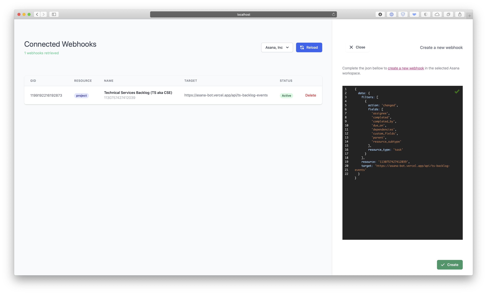

# 🤖 Asana Bot

A sample portal that manages automations and other scripts on [Asana](https://asana.com).

This portal is designed for [Vercel](https://vercel.com/home?utm_source=next-site&utm_medium=banner&utm_campaign=next-website).

<!--  -->

## Documentation

_TBC in the [Wiki](https://github.com/rubengarciam/asana-bot/wiki) section. It will include full documentation, guides and other information._

## Webhooks

You will need to expose your own services to handle the Asana Webhooks and your workflows' logic. 

Some api endpoints have been already deployed to mimmic some possible interactions:

- [asana-bot.vercel.app/api/webhooks](https://asana-bot.vercel.app/api/webhooks)
- [asana-bot.vercel.app/api/new-story](https://asana-bot.vercel.app/api/new-story)
- [asana-bot.vercel.app/api/new-task](https://asana-bot.vercel.app/api/new-task)

## Setup

Create a `.env.local` file with the following:

```
AUTH_COOKIE="ASANA_BOT"
NODE_ENV="development"
AUTH_SECRET="a_strong_secret"
AUTH_USER="user_email"
AUTH_PASSWD="user_password_strong_min_32_chars"
NEXT_PUBLIC_ASANA_TOKEN="Bearer TOKEN"
```

## Commands

Run development locally:

```batch
npm run dev
```

 ### Build Locally

Build locally:

```batch
npm run build
```

Start prod locally:

```batch
npm run start
```

### Deploy to Vercel

Deploy to Vercel in preview:

```batch
vercel
```

Deploy to Vercel in production:

```batch
vercel --prod
```

## Dependencies

This project uses the following external libraries 🙌 :

- [Axios](https://github.com/axios/axios)
- [Next.js](https://nextjs.org)
- [Tailwind CSS](https://tailwindcss.com) and [Headless UI](https://headlessui.dev)

  
[React](http://reactjs.org) specific libraries:

- [http-status-codes](https://github.com/prettymuchbryce/http-status-codes)
- [iron-session](https://github.com/vvo/iron-session)
- [react-json-editor-ajrm](https://github.com/AndrewRedican/react-json-editor-ajrm#readme)
- [react-responsive](https://github.com/contra/react-responsive)
- [react-transition-group](http://reactcommunity.org/react-transition-group/)
- [swr](https://github.com/vercel/swr)
